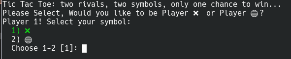
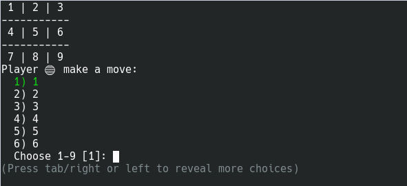
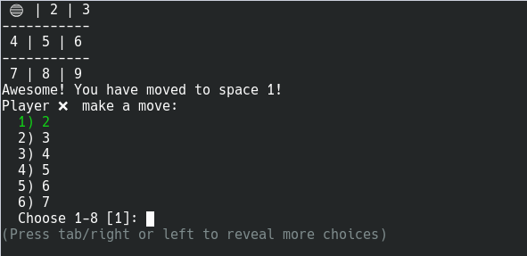
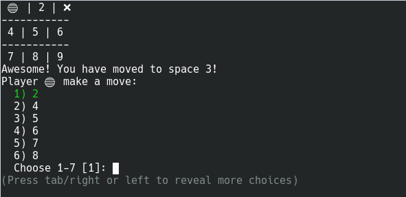
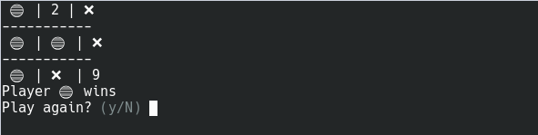
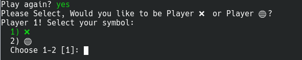
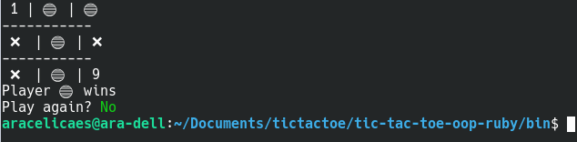

<!-- PROJECT LOGO -->
# Tic-Tac-Toe-game
A Ruby implementation of the loved Tic Tac Toe game.
<!-- TABLE OF CONTENTS -->
## Table of Contents
- [Tic-Tac-Toe-game](#tic-tac-toe-game)
  - [Table of Contents](#table-of-contents)
- [About The Project](#about-the-project)
  - [Tic Tac Toe in Ruby](#tic-tac-toe-in-ruby)
    - [Live Environment](#live-environment)
  - [How to Test](#how-to-test)
  - [How to Play](#how-to-play)
  - [Features:](#features)
    - [Built with Ruby](#built-with-ruby)
  - [Built With](#built-with)
  - [About TTY-Prompt](#about-tty-prompt)
- [Getting started](#getting-started)
  - [Installation](#installation)
- [Contact](#contact)
- [Acknowledgements](#acknowledgements)
<!-- ABOUT THE PROJECT -->
# About The Project
## Tic Tac Toe in Ruby
This is a Tic Tac Toe game, developed following the OOP paradigm and built in Ruby.

### Live Environment
Check out the Live Version we have created for you by clicking on the next link: 
[Go to Live Version](https://gitpod.io/github.com/wickathou/tic-tac-toe-oop-ruby/tree/testing)

## How to Test
**(*Please test in the live environment we have created for you [Here](https://gitpod.io/github.com/wickathou/tic-tac-toe-oop-ruby/tree/testing) or take a minute to clone the repo.*)** 
 
We have created an alternative way to test the game by adding a parameter in the `Game.New` instance. With these you'll be able to run an automated version of the game which will throw: Winner X, Winner X, Looser X, Looser O, Draw when X begins and Draw when O begins. All you have to do is add a parameter into line 5 `Game.New` that is found in our `main` file to test them and then run the `ruby main` file in the console. The parameters that we have built-in for testing are:

- `Game.New('testing')`  Plays, displays winner X
- `Game.New('alt')`  Plays, displays winner O
- `Game.New('loser')` Plays, displays looser X
- `Game.New('altloser')` Plays, displays looser O
- `Game.New('draw')` Plays, displays draw when X starts the Game
- `Game.New('altdraw')` Plays, displays draw when O starts the Game

We have also added these parameters in the `game_spec.rb `file to facilitate the rspec testing for you.

## How to Play
**Read all instructions the game prompts carefully**
1. Player_1 will be prompted to select their symbol (Press 1 for X or Press 2 for O).

 
2. Once Player_1 has selected their symbol player 2 will get assigned the remaining symbol by default. 
  Afterwards, Player_1 will be prompted to selecte their first move from a list of available choices.

 
3. The system will confirm the move selected by Player_1 and then promt Player_2 to select their move.

 
4. The system will alternate turns between players while it prints out the selected positions on the board. 
   Make sure that the position you select is available. Otherwise it will throw an error!

 
5. The game will come to a stop if there is a WIN or a DRAW. A WIN can be reached by having the same symbol appear  
   3 positions in a row either diagonally, horizontally or vertically. Otherwise, it's considered a TIE/DRAW!

 
6. Once the game has ended, players will be asked if they wish to start another game, if y (yes) is selected 
   a new instance of the game will be started.

 
7. If N (no) is selected, the Game is oficially finished.

 
 

Welcome to Tic-Tac-Toe! Have tons of fun! :D

 

## Features:
### Built with Ruby
- You can check the game using Ruby
## Built With
* Ruby
* TTY-Prompt
* Bundler
## About TTY-Prompt
TTY-Prompt is a nifty little gem that facilitates the getting and validation of inputs! 
For more information check the links below. 
* Download Gem Details[tty-promt](https://rubygems.org/gems/tty-prompt)
* Source Code [tty-promt-source-code](https://github.com/piotrmurach/tty-prompt) (Everything about TTY-Prompt! How you can adapt it and all it's different funtionalities.)

<!-- GETTING STARTED -->
# Getting started
## Installation
* Clone the repo following [this link](https://github.com/wickathou/tic-tac-toe-oop-ruby)
* Install all dependencies running from terminal the command `bundle install`
* Run from terminal `bin/main`
<!-- CONTACT -->
# Contact
* Ara Camarillo [aracelicaes](https://github.com/aracelicaes)
* Javier Hernandez [wickathou](https://github.com/wickathou)
* Project Link: [Click Here](https://github.com/wickathou/tic-tac-toe-oop-ruby)
<!-- ACKNOWLEDGEMENTS -->
# Acknowledgements
- [The Odin Project](https://www.theodinproject.com)
- [Microverse](https://microverse.org)
- [othneildrew](https://github.com/othneildrew) => [Best-README-Template](https://github.com/othneildrew/Best-README-Template)
- [TTY-Prompt Gem by Piotr Murach](https://rubygems.org/profiles/piotrmurach)
